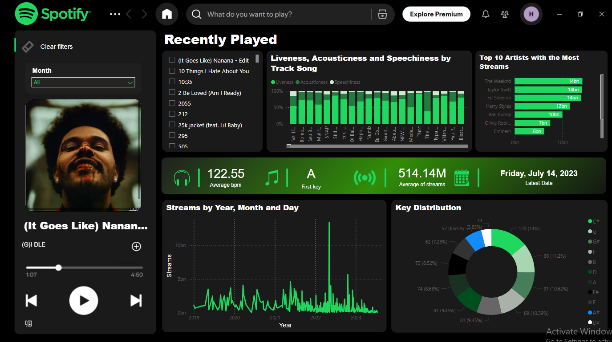

# **🎶 Spotify Listening Analytics Dashboard**
A comprehensive Power BI solution that transforms complex music streaming data into actionable insights. This interactive dashboard analyzes 953 popular tracks from 2023, helping stakeholders understand listening patterns, track characteristics, and artist performance in an era where 120,000 new songs are uploaded to streaming platforms daily.

## 🎯 Problem Statement
Music platforms generate massive amounts of data, making it challenging to quickly identify:

- The most popular songs and artist trends
- The key audio attributes that drive a song's success (e.g., danceability, energy, liveness)
- Temporal patterns in music consumption
- Musical characteristics that resonate with listeners

## 🔧 Power BI Components

- **Dynamic Filters:** Month-based and custom filtering system
- **DAX Measures:** Custom calculations for averages, percentages, and aggregations
- **Spotify-Themed UI:** Brand-consistent green color scheme

## 📁 Data Source & Scope

| Metric Category | Key Data Points     |               
| :-------- | :------- | 
| Track Performance | Streams, presence in charts, and playlist features | 
| Audio Attributes | BPM, key, mode, danceability, valence, energy, liveness, acousticness, speechiness | 
| Contextual Data | Track name, artist name, release date, and album information | 

**Dataset:** 953 popular tracks from 2023

